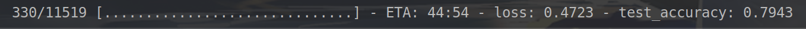

# bert-tf2-keras
可能是最原汁原味的tf2版本的bert/albert实现.
参考了[tensorflow/models](https://github.com/tensorflow/models/tree/master/official/nlp)以及
[google-research/albert](https://github.com/google-research/albert), 总体结构和官方的tf1.x版本保持一致,方便阅读和再修改.
- 删除了一些不常见的API,全部使用目前常用的tf.keras API.
- 增加模型同时支持albert和bert
- 增加了直接加载tf1.x版本的预训练albert/bert的checkpoint功能
- 增加albert中不共享transformer参数的功能
- 分离了预处理数据和训练测试的过程以减少重复操作

## 如何使用
1. 自行实现自己的task model, 可参考我提供的[text classifier model](models/classifier.py)
2. 训练测试可以直接使用`model.fit`和`model.predict`,可参考[run_classifier.py](run_classifier.py)

